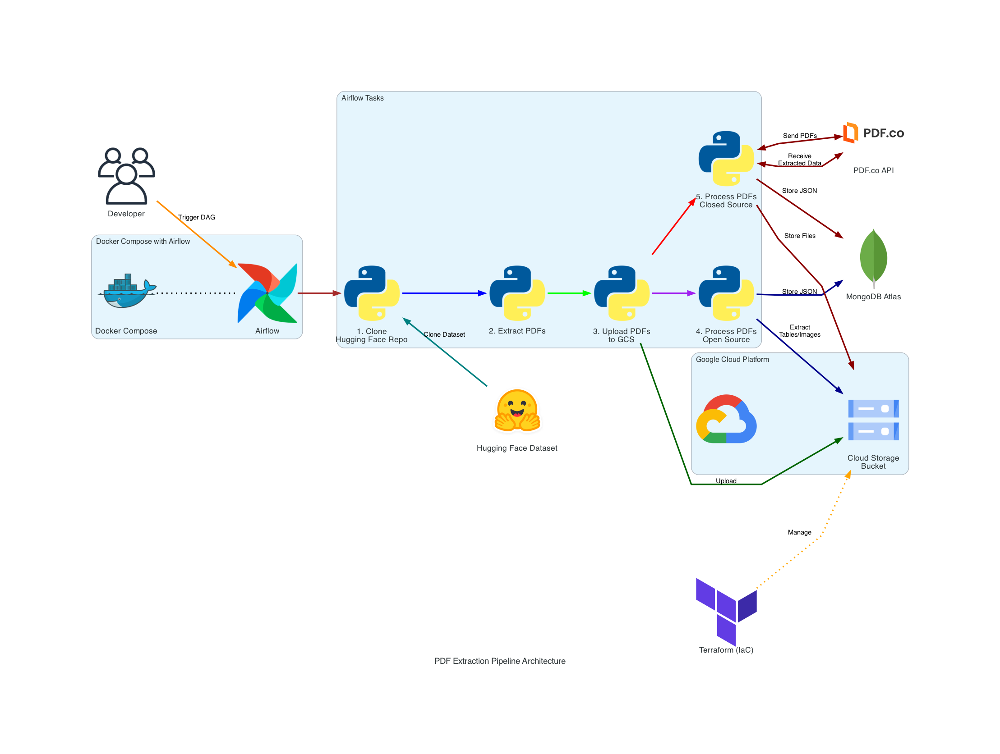
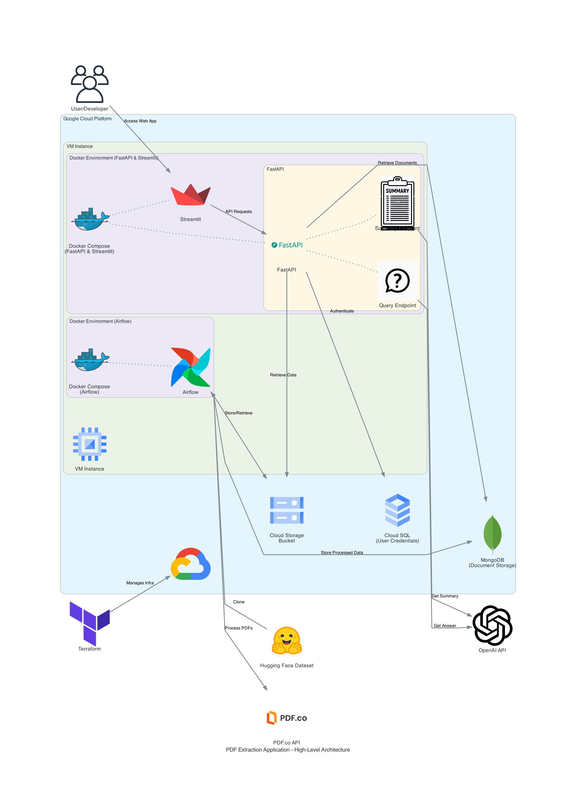

# Assignment 2 - Document Processing and Querying Platform

## Project Links and Resources

- **GitHub Issues and Tasks**: [Link to GitHub Project Issues](https://github.com/orgs/DAMG7245-Big-Data-Sys-SEC-02-Fall24/projects/2/views/1)
- **Codelabs Documentation**: [Link to Codelabs](https://codelabs-preview.appspot.com/?file_id=1ijPlOEwtWk1SbEUBnvgiQf8MsbyyGoimfVTTof3nXEc#0)
- **Project Submission Video (5 Minutes)**: [Link to Submission Video](https://drive.google.com/drive/folders/1wgYeUY-HsDuWcqGq1hSNVRQ3gvQBMLZC)
- **Hosted Application Links**:
  - **Frontend (Streamlit)**: [Link to Streamlit Application](http:/35.196.79.156:8501:8501)
  - **Backend (FastAPI)**: [Link to FastAPI Application](http:/35.196.79.156:8501:8000/docs)
  - **Data Processing Service (Airflow)**: [Link to Data Processing Service](http:/35.196.79.156:8501:8080)

## Introduction

This project demonstrates the integration of various technologies for extracting and processing documents, specifically PDFs, using both open-source and closed-source tools. The extracted data is processed and stored using a cloud-based infrastructure, while a client-facing Streamlit application allows users to interact with the extracted data, such as querying and summarization, powered by GPT models.

The core technologies used in this project include:
- **PyMuPDF** and **PDF.co**: Used for PDF text extraction.
- **Google Cloud Platform (GCP)**: For storage, database, and deployment.
- **FastAPI**: Backend for handling requests and user authentication.
- **Streamlit**: Frontend for the client-facing application.
- **Airflow**: Orchestrating and automating the ETL process.
- **MongoDB**: Storing extracted document data.
- **PostgreSQL**: Storing user credentials and managing authentication.
- **OpenAI GPT Models**: For summarization and query processing.

The project aims to provide a comprehensive platform for extracting, storing, and interacting with document data, ensuring secure user management and scalable deployment.

## Problem Statement

The challenge is to develop a secure platform where users can:
1. Extract and store document data in a structured format.
2. Query and summarize the extracted data using advanced models.
3. Ensure scalable infrastructure and authentication mechanisms.

There is a need for an automated, efficient pipeline to handle the extraction and storage process, a secure backend to manage user authentication and data access, and an intuitive frontend for users to interact with the system.


## Deliverables Checklist

### Part 1: Automating Text Extraction and Database Population
- [ ] Create Airflow pipelines for automating data acquisition from the GAIA dataset.
- [ ] Implement the pipeline for processing files from the GAIA Benchmarking Validation & Testing Dataset.
- [ ] Integrate text extraction using:
  - [ ] One open-source option (e.g., PyPDF).
  - [ ] One enterprise/API option (e.g., AWS Textract, Adobe PDF Extract, or Azure AI Document Intelligence).
- [ ] Ensure extracted information is populated into the data storage system (e.g., S3).

### Part 2: Client-Facing Application Development
#### FastAPI
- [ ] Implement user registration and login functionality.
- [ ] Secure application using JWT authentication:
  - [ ] Protect all endpoints except for registration and login.
  - [ ] Ensure JWT token is required for accessing protected endpoints.
  - [ ] Indicate protected endpoints with padlock icon in Swagger UI.
- [ ] Use a SQL database for storing user credentials with hashed passwords.
- [ ] Move business logic to a FastAPI backend service.
- [ ] Define services to be invoked through Streamlit.

#### Streamlit
- [ ] Develop user-friendly registration and login page.
- [ ] Implement Question Answering interface for authenticated users.
- [ ] Enable selection from a variety of preprocessed PDF extracts.
- [ ] Ensure the system can query specific PDFs upon selection.

### Deployment
- [ ] Containerize FastAPI and Streamlit applications using Docker Compose.
- [ ] Deploy applications to a public cloud platform.
- [ ] Ensure deployed applications are publicly accessible for seamless user interaction.

### Submission
- [ ] Fully functional Airflow pipelines, Streamlit application, and FastAPI backend.
- [ ] Ensure all services are deployed and publicly accessible with documentation.
- [ ] Include the following in the GitHub repository:
  - [ ] Project summary, research, PoC, and other information.
  - [ ] GitHub project issues and tasks.
  - [ ] Diagrams explaining the architecture and flow.
  - [ ] Fully documented Codelabs document.
  - [ ] 5-minute video of the project submission.
  - [ ] Link to hosted applications, backend, and data processing services.

### Desired Outcome:
- Secure extraction of PDF data.
- Efficient querying and summarization of documents.
- Scalable and user-friendly infrastructure for deployment.

### Constraints:
- Handling large datasets (PDFs from the GAIA dataset).
- Managing multiple APIs for extraction (open-source and closed-source).
- Ensuring security with JWT-based authentication.

## Proof of Concept

The project uses two main technologies for PDF extraction:
- **PyMuPDF** (open-source) and **PDF.co** (closed-source) APIs.
  
The extracted data is stored in GCP and MongoDB for easy querying and further processing. Initial setup involved:
- Setting up Airflow for automating the extraction process.
- Configuring MongoDB to store document metadata and extracted text.
- Implementing FastAPI for backend functionalities and integrating OpenAI's GPT models for summarization and querying.

Challenges such as managing API limits and optimizing extraction pipelines have been addressed by caching results and using efficient database queries.

## Project Directory Structure

Here is the complete directory structure of the project:

```
.
├── .gitignore
├── docker-compose.yaml
├── pyproject.toml
├── README.md
├── airflow_pipelines
│   ├── dags
│   │   ├── dag.py
│   │   ├── task1.py
│   │   ├── task2.py
│   │   ├── task3.py
│   │   ├── task4.py
│   │   └── task5.py
│   └── docker-compose.yaml
├── backend
│   ├── app
│   │   ├── config
│   │   │   └── settings.py
│   │   ├── controllers
│   │   │   └── auth_controller.py
│   │   ├── main.py
│   │   ├── models
│   │   │   └── user_model.py
│   │   ├── routes
│   │   │   ├── auth_routes.py
│   │   │   ├── query_routes.py
│   │   │   └── summary_routes.py
│   │   └── services
│   │       ├── auth_service.py
│   │       ├── database_service.py
│   │       ├── document_service.py
│   │       ├── gpt.py
│   │       ├── mongo.py
│   │       ├── object_store.py
│   │       └── tools.py
│   ├── Dockerfile
│   └── pyproject.toml
├── frontend
│   ├── main.py
│   ├── services
│   │   ├── ObjectStore.py
│   │   ├── authentication.py
│   │   ├── service.py
│   │   └── session_store.py
│   ├── Dockerfile
│   └── pyproject.toml
├── infra
│   ├── bucket.tf
│   ├── firewall.tf
│   ├── main.tf
│   ├── sql.tf
│   ├── ssh.tf
│   ├── terraform.tfvars
│   ├── vm.tf
│   └── vpc.tf
├── prototyping
│   ├── docparser_login.py
│   ├── extract_pdf_files_from_folder.py
│   ├── hf_clone.py
│   ├── mongo_conn.py
│   ├── opensource_pdf_test.ipynb
│   ├── pdf_co_testing.ipynb
│   ├── pdf_plumber_extract_table.py
│   └── pymupdf_fix.ipynb
└── sql
    └── schema.sql
```

### Directory Descriptions:

- **`airflow_pipelines`**:
  Contains the DAGs (Directed Acyclic Graphs) for orchestrating the extraction pipeline using Airflow. These DAGs define the tasks to be executed in sequence for text extraction, storing data, and performing other ETL processes.

- **`backend`**:
  - `app`: Houses the FastAPI backend which includes authentication, document querying, and summarization services.
  - `config`: Contains configuration settings for the backend such as environment variables and database connection.
  - `controllers`: Implements the logic for user authentication.
  - `routes`: Manages the API endpoints for authentication, document querying, and summarization.
  - `services`: Core services for handling business logic, database interactions, and API calls to GPT models and MongoDB.
  - `Dockerfile`: Configuration to build the backend FastAPI Docker container.
  - `pyproject.toml`: Python dependencies for the backend.

- **`frontend`**:
  - Contains the Streamlit frontend which interacts with the backend to allow users to select, query, and summarize documents.
  - `services`: Includes the logic for interacting with GCP for file storage and authentication handling.
  - `Dockerfile`: Configuration to build the frontend Streamlit Docker container.
  - `pyproject.toml`: Python dependencies for the frontend.

- **`infra`**:
  Infrastructure setup for the project using Terraform. This includes:
  - GCP resource definitions (storage buckets, VMs, PostgreSQL, etc.).
  - Security configurations such as firewalls and SSH keys.
  - `sql.tf`: Defines the setup for the PostgreSQL database in GCP.

- **`prototyping`**:
  Contains various scripts and notebooks used during the development and testing phase of the project for different PDF extraction methods and database connections.

- **`sql`**:
  Defines the SQL schema for the PostgreSQL database, including the Users table for authentication.

## Architecture Diagram




### Description of Components:
- **Airflow**: Orchestrates the ETL pipeline for extracting PDF text and storing it in MongoDB.
- **FastAPI**: Handles user registration, authentication, and requests to process and query the extracted data.
- **Streamlit**: The client-facing frontend where users can select documents, summarize them, or query specific content.
- **MongoDB**: Stores the extracted text and metadata.
- **PostgreSQL**: Stores user information for authentication.
- **GCP (Google Cloud Platform)**: Provides the infrastructure for the entire platform, including storage (GCS) and VM instances for deployment.
- **OpenAI GPT Models**: Used for querying and summarization of document content.

### Data Flow:
1. PDFs are uploaded to GCP storage.
2. Airflow pipelines extract text using open-source or closed-source tools.
3. Extracted data is stored in MongoDB and GCP for further processing.
4. Users interact with the data through the Streamlit frontend, querying and summarizing the documents.

### Challenges Faced:
- **API Rate Limits**: Handled by caching results and optimizing request frequency.
- **Large File Handling**: Implemented efficient streaming methods for large PDFs.
- **Authentication**: Secured the API endpoints using JWT tokens to prevent unauthorized access.


**Team Members:**
- Uday Kiran Dasari - Backend ,Docker, Fronted - 33.3%
- Sai Surya Madhav Rebbapragada - Backend, Frontend, Integratrion - 33.3%
- Akash Varun Pennamaraju - Airflow, Infra setup - 33.3%


## References

- [FastAPI Documentation](https://fastapi.tiangolo.com/)
- [Streamlit Documentation](https://docs.streamlit.io/)
- [Airflow Documentation](https://airflow.apache.org/docs/)
- [OpenAI GPT API](https://platform.openai.com/docs/)
- [PyMuPDF](https://pymupdf.readthedocs.io/en/latest/)
- [Google Cloud Storage](https://cloud.google.com/storage/docs/)

